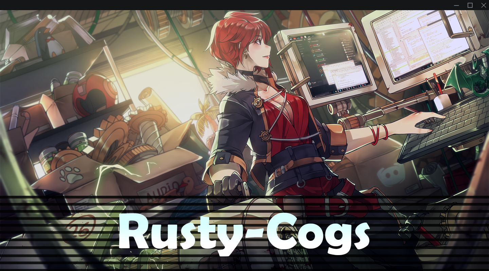

## NOTE: You will find a dedicated README (guide) in the cogs' respective folders.
---
<p align="center">
  <a href=".banner/">
    
  </a>
  <h1 align="center"></h1>
</p>

# Installation⠀✿
---
```text
repo add rusty-cogs https://github.com/rusty-man/rusty-cogs
```
```text
cog install rusty-cogs cog
```
```text
load cog
```

# Cogs⠀✿
---
| NAME        | RELEASE          | DESCRIPTION                                                      |
|-------------|------------------|------------------------------------------------------------------|
| [Avatar](avatar/)      | Stable      | Returns a user's avatar in an embed                         |
| [Banner](banner/)      | Stable      | Returns a user's banner in an embed                         |
| [Echo](echo/)          | Stable      | Makes the bot say something in the specified channel.       |
| [Gulag](gulag/)        | Beta        | Gulag users by restricting them to a channel.               |
| [ListEmoji](listemoji/)| Stable      | Get a list of emojis in your server. ~ Kennnyshiwa          |
| [VoteMod](votemod/)    | Stable      | Vote-based moderation command for banning / kicking users.  |
| [WaifuIM](waifuim/)    | Stable      | Get images from waifu.im api ~ PhantomNimbi                 |
|⠀   ⠀                   |⠀⠀⠀⠀⠀⠀⠀⠀⠀⠀⠀⠀⠀⠀⠀|⠀⠀⠀⠀ ⠀⠀⠀⠀⠀⠀⠀                                         |

# Contact⠀✿
---
➥ dm me - `1eus` or `0eus`
<br/> <br/>
➥ ping me in [#support_othercogs](https://discord.com/channels/240154543684321280/240212783503900673) in the [Red - Cog Support](https://discord.gg/red-cog-support-240154543684321280) server
