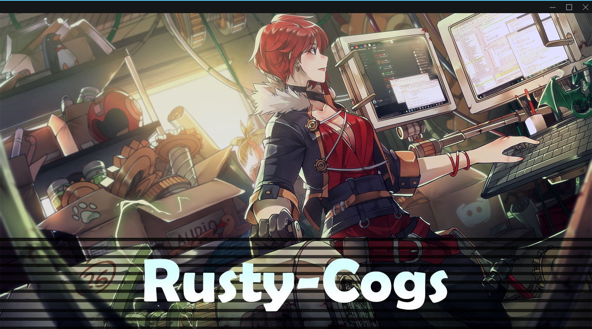

## NOTE: You will find a dedicated README (guide) in the cogs' respective folders.
---
<p align="center">
  <a href=".archive/">
    
  </a>
  <h1></h1>
</p>

# Installation⠀⚒
---
```text
repo add rusty-cogs https://github.com/rusty-man/rusty-cogs
```
```text
cog install rusty-cogs cog
```
```text
load cog
```

# Cogs⠀⚒
---
| NAME             | RELEASE          | DESCRIPTION                                                      |
|------------------|------------------|------------------------------------------------------------------|
| [Avatar](avatar/)          | Stable      | Returns a user's avatar in an embed (supports decoration).  |
| [Banana](banana/)          | Stable      | Show someone your banana or eat theirs.                     |
| [Banner](banner/)          | Stable      | Returns a user's banner in an embed.                        |
| [Echo](echo/)              | Stable      | Makes the bot say something in the specified channel.       |
| [GetID](getid/)            | Beta        | Get ID of a discord model \[user/channel/role/emoji/guild\] |
| [Gulag](gulag/)            | Beta        | Gulag users by restricting them to a channel.               |
| [ListEmoji](listemoji/)    | Stable      | Get a list of emojis in your server.                        |
| [MeatRider](meatrider/)    | Stable      | Send a random meatrider image pointed at someone.           |
| [RegexSearch](regexsearch/)| Alpha       | Search messages in a channel with regex.                    |
| [Timeout](timeout/)        | Beta        | Manage timeouts for a user.                                 |
| [VoteMod](votemod/)        | Stable      | Vote-based moderation command for banning / kicking users.  |
| [WaifuIM](waifuim/)        | Stable      | Get images from waifu.im api.                               |
|⠀   ⠀                   |⠀⠀⠀⠀⠀⠀⠀⠀⠀⠀⠀⠀⠀⠀⠀|⠀⠀⠀⠀ ⠀⠀⠀⠀⠀⠀⠀                                         |

# Contact⠀⚒
---
➥ dm me - [`1eus`](https://discordapp.com/users/727378306340487178) or `0eus` || you can open an issue [-here-](https://github.com/rusty-man/rusty-cogs/issues) aswell
<br/> <br/>
➥ ping me in [#support_othercogs](https://discord.com/channels/240154543684321280/240212783503900673) in the [Red - Cog Support](https://discord.gg/red-cog-support-240154543684321280) server
